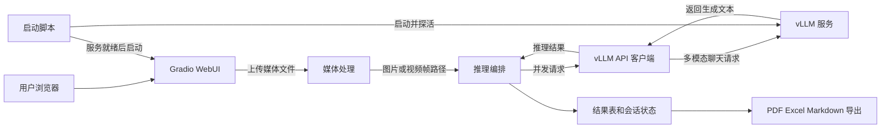

# vllm_infer_webui
# vLLM Infer WebUI

一个基于 **Gradio** 与 **vLLM OpenAI 兼容接口**的多模态推理界面。用户可以上传图片或视频，对图片或视频抽帧发起视觉问答，并将分析结果导出为 PDF、Excel 或 Markdown。

当前默认提示词面向铁路工务巡检场景，用于判断铁轨扣件是否被沙尘掩埋；你可以在 [`config.py`](./config.py) 中替换为任意视觉分析业务的提示词。

> **架构说明：** 本项目的 WebUI 不直接加载模型权重。`start.sh` 先启动独立的 vLLM 服务，`app.py` 再通过 HTTP 向 vLLM 的 `/v1/chat/completions` 接口发起多模态请求。vLLM 官方提供 OpenAI 兼容的 Chat API，并支持视觉输入。[1][1]

## 功能特性

| 功能 | 当前实现 |
|---|---|
| 图片推理 | 支持 JPG、JPEG、PNG、BMP、WebP 上传与多模态问答。 |
| 视频推理 | 支持 MP4、AVI、MOV、MKV、FLV、WMV、WebM；系统按固定帧间隔抽帧后逐图推理。 |
| 并发请求 | 一个任务内以线程池同时向 vLLM 发起多条 HTTP 请求；实际模型调度由 vLLM 完成。 |
| 结果展示 | Gradio 页面按批次增量刷新结果、进度和累计耗时。 |
| 导出 | 可下载带原图与分析结果的 PDF，以及 Excel、Markdown 结果文件。 |
| 服务状态 | 页面定时请求 vLLM 的 `/v1/models`，显示服务与已加载模型状态。 |
| 中英文界面 | 可切换中文与英文界面文字。 |

## 架构与数据流



## 项目结构

| 文件 | 作用 |
|---|---|
| [`start.sh`](./start.sh) | 选择本地或远端模型，启动 vLLM 服务，等待服务就绪后启动 Gradio。 |
| [`app.py`](./app.py) | Gradio 页面、上传事件、批量任务编排、进度更新与导出按钮。 |
| [`infer.py`](./infer.py) | vLLM HTTP 客户端；负责模型探测、图片 Base64 编码、请求发送与并发控制。 |
| [`config.py`](./config.py) | 默认提示词、服务地址、超时、并发上限、默认生成参数与视频抽帧间隔。 |
| [`utils.py`](./utils.py) | 图片/视频类型判断与 OpenCV 视频抽帧。 |
| [`pdf_export.py`](./pdf_export.py) | 图文 PDF 与旧版表格 PDF 导出。 |
| [`requirements.txt`](./requirements.txt) | 当前仓库依赖清单。 |

## 环境要求

项目元数据要求 **Python 3.10 及以上**。运行 vLLM 通常需要与模型、CUDA/ROCm 和驱动版本匹配的 GPU 环境；请优先参照 vLLM 官方安装文档完成 vLLM 环境配置。[2][2]

当前 `requirements.txt` 没有完整列出所有代码直接使用的依赖，尤其是 `vllm`、`requests` 与 `opencv-python`。在干净环境中，建议先安装仓库依赖，再补齐 WebUI 与 vLLM 运行所需组件。以下命令是一个最小起点；vLLM 的具体版本仍应按你的 CUDA、驱动和模型兼容性确定。

```bash
git clone https://github.com/zhaoyan272898-cyber/vllm_infer_webui.git
cd vllm_infer_webui

python3 -m venv .venv
source .venv/bin/activate
python -m pip install --upgrade pip
pip install -r requirements.txt
pip install vllm requests opencv-python
```

> 建议将依赖统一维护在 `pyproject.toml` 或 `requirements.txt` 中。当前 `pyproject.toml` 只声明 ReportLab，不能单独用于复现完整运行环境。

## 快速启动

### 方式一：使用项目启动脚本

先打开 [`start.sh`](./start.sh)，按实际环境修改模型配置。脚本会优先使用本地模型目录；目录不存在或为空时，才会按 `MODEL_ID` 加载模型。

```bash
# start.sh 中需要重点检查的配置
export MODEL_ID="qwen/Qwen2.5-VL-7B-Instruct"
export LOCAL_MODEL_PATH="/你的/模型/本地目录"
export VLLM_API_BASE="http://localhost:8000/v1"
```

确认路径和 Python 环境正确后执行：

```bash
bash start.sh
```

脚本会先启动 vLLM，再轮询下列地址直到服务就绪：

```bash
curl http://localhost:8000/v1/models
```

vLLM 就绪后，脚本会运行 `python3 app.py`。请按终端输出的本地访问地址打开 WebUI。

### 方式二：连接已有的 vLLM 服务

如果 vLLM 已经在另一台机器或另一个容器中运行，只需配置 WebUI 客户端地址后单独启动 `app.py`：

```bash
export VLLM_API_BASE="http://<vllm-host>:8000/v1"
export VLLM_MODEL_NAME="<vllm-服务暴露的模型名>"
python3 app.py
```

其中 `VLLM_API_BASE` 必须包含 `/v1` 前缀。若未设置 `VLLM_MODEL_NAME`，程序会调用 `<VLLM_API_BASE>/models` 并采用返回列表中的第一个模型 ID。

## 使用方法

打开 WebUI 后，上传一张或多张图片，或者上传支持的视频文件。对于视频，系统会先以 `FRAME_INTERVAL` 指定的帧数间隔抽帧；之后每个视频帧都作为独立图片请求发给 vLLM。输入提示词、温度和最大生成 token 后，点击“开始推理”，结果会在表格中逐步显示。

推理完成后可分别点击 PDF、Excel 或 Markdown 导出按钮。PDF 会按“报告标题、用户问题、原图、分析结果”的顺序生成内容；当前实现默认每张图片独占一页。

## 配置说明

以下常用配置均在 [`config.py`](./config.py) 或 [`start.sh`](./start.sh) 中维护。

| 配置 | 位置 | 当前用途 | 修改建议 |
|---|---|---|---|
| `MODEL_ID` | `start.sh` | 本地模型不存在时的远端模型标识。 | 替换模型时优先修改此项或 `LOCAL_MODEL_PATH`，不要依赖已废弃的 `MODEL_PATH`。 |
| `LOCAL_MODEL_PATH` | `start.sh` | 本地模型权重目录，存在且非空时优先使用。 | 改为你的绝对路径，或置空以使用 `MODEL_ID`。 |
| `VLLM_API_BASE` | `config.py` / `start.sh` | WebUI 请求 vLLM 服务的基础地址。 | 默认是 `http://localhost:8000/v1`；连接远端服务时修改。 |
| `VLLM_MODEL_NAME` | 环境变量 | API 请求中的模型名。 | 推荐与 vLLM 的 `--served-model-name` 保持完全一致。 |
| `VLLM_TIMEOUT` | `config.py` | 单个 API 请求的超时秒数。 | 长视频或长回答场景可适度增大。 |
| `DEFAULT_PROMPT` | `config.py` | 初始业务提示词。 | 按你的视觉任务修改；建议明确输出字段和异常图像处理要求。 |
| `DEFAULT_TEMPERATURE` | `config.py` | 默认随机性参数。 | 检测/抽取类任务通常使用较低值以减少波动。 |
| `DEFAULT_MAX_TOKENS` | `config.py` | 单次回答的最大生成 token。 | 输出格式固定时可适当降低，以缩短耗时。 |
| `MAX_CONCURRENT_REQUESTS` | `config.py` | WebUI 发起 HTTP 并发的上限。 | 需要按实际 GPU、模型、图像尺寸与压测结果设置。 |
| `MEMORY_PER_REQUEST_GB` | `config.py` | 自动并发的显存估算值。 | 仅为粗略启发式，不能替代真实显存与吞吐压测。 |
| `FRAME_INTERVAL` | `config.py` | 每隔多少视频帧抽取一张图。 | 不同 FPS 视频对应不同实际时间间隔；生产场景建议改为按秒采样。 |
| `--max-model-len` | `start.sh` | vLLM 的输入加输出上下文上限。 | 图像 token、提示词、输出长度和并发都会影响显存需求。[3][3] |
| `--gpu-memory-utilization` | `start.sh` | vLLM 可使用的 GPU 显存预算比例。 | 必须结合模型和实际负载压测；过高可能增加 OOM 风险。[3][3] |

## 已知限制与维护提醒

| 项目 | 当前状态 | 建议 |
|---|---|---|
| `top_p` | UI 提供了 Top-p 滑块，但当前请求体没有传递 `top_p`，调整该控件不会影响实际结果。 | 修改 `infer.py` 的请求函数签名与 JSON payload，并从 `app.py` 逐层传入。 |
| 并发估算 | WebUI 与 vLLM 是独立进程；WebUI 内 `torch.cuda.memory_allocated()` 不能可靠代表 vLLM 的真实显存占用。 | 使用 `nvidia-smi`、vLLM 指标、端到端延迟和错误率压测后设定并发。 |
| 停止任务 | 停止标志是进程全局变量，且只在批次边界检查，不能中断已发送的 HTTP 请求。 | 多用户部署时改为会话级状态和请求级取消机制。 |
| 视频抽帧文件 | 帧写入 `outputs/frames/<视频名>/`，无自动清理；同名视频可能发生复用或覆盖。 | 使用任务 UUID 目录，并在任务完成后清理临时文件。 |
| PDF 图片体积 | 当前 PDF 使用原始图片数据，只缩放显示宽度，不做真实压缩。 | 大批量或高分辨率图片场景下，增加可选图片压缩与文件大小限制。 |
| 模型安全 | `start.sh` 默认开启 `--trust-remote-code`。 | 仅对已审查、可信且固定版本的模型启用；该参数默认应保持关闭。[3][3] |
| 外网部署 | 当前项目未实现 WebUI 登录、请求鉴权或反向代理。 | 不要直接将页面和 vLLM 端口暴露到公网；应配合 HTTPS、认证、限流和网络隔离。vLLM 的 API Key 也不应被视为唯一安全边界。[1][1] |

## 故障排查

| 现象 | 检查方式 | 常见处理 |
|---|---|---|
| 页面显示“vLLM 服务未连接” | 执行 `curl http://localhost:8000/v1/models`。 | 检查 vLLM 是否已启动、端口是否一致、`VLLM_API_BASE` 是否包含 `/v1`。 |
| vLLM 启动后立即退出 | 查看启动终端日志。 | 核对 CUDA/驱动、模型路径、模型兼容性、量化格式与可用显存。 |
| 返回模型名错误 | 检查 `/v1/models` 返回内容和 `VLLM_MODEL_NAME`。 | 使用 vLLM 的 `--served-model-name` 固定别名，并让环境变量使用相同名称。 |
| 视频无法处理 | 检查文件扩展名和 OpenCV 安装。 | 确认已安装 `opencv-python`，并尝试将视频转为 MP4/H.264。 |
| 中文 PDF 显示异常 | 检查系统中的中文字体。 | 在 `pdf_export.py::register_chinese_font()` 中补充部署环境的字体路径。 |
| 推理过程中显存不足 | 降低并发、图像尺寸、`max_tokens` 或上下文长度。 | 优先做压测并使用真实 vLLM 显存指标，而不是只调整一个固定参数。 |

## 安全提示

本项目会处理用户上传的图片和视频，并把内容以 Base64 形式发送到配置的 vLLM 服务。部署前应明确数据是否允许离开本机或内网。对于远端 vLLM、云端 GPU 或多人使用场景，请配置网络访问控制、传输加密、鉴权、日志脱敏、文件大小限制与临时文件清理策略。

## 参考资料

[1]: https://docs.vllm.ai/en/latest/serving/online_serving/openai_compatible_server/ "vLLM：OpenAI-Compatible Server"
[2]: https://docs.vllm.ai/en/latest/getting_started/installation/ "vLLM：Installation"
[3]: https://docs.vllm.ai/en/stable/configuration/engine_args/ "vLLM：Engine Arguments"
